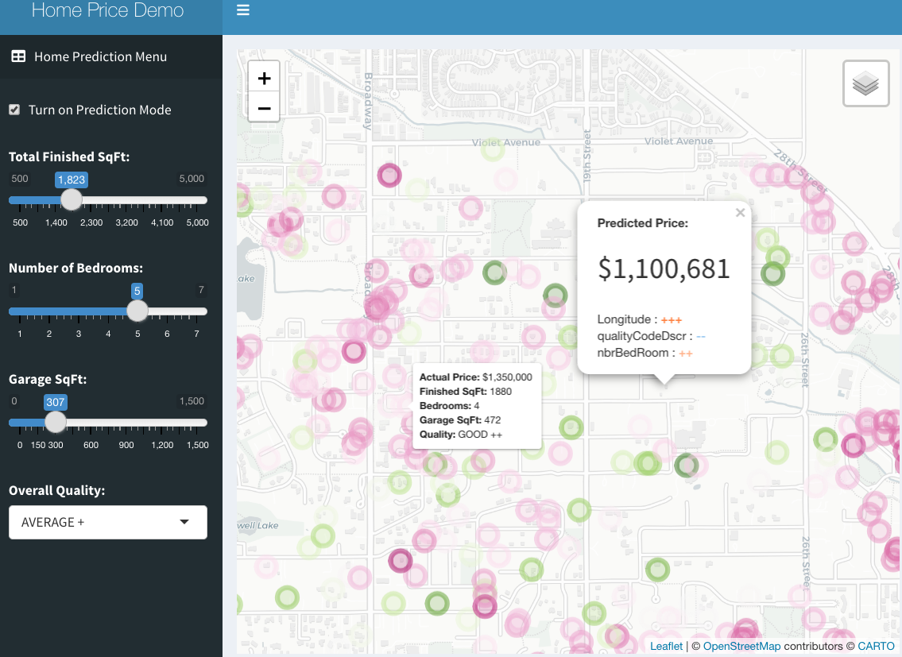

<!-- README.md is generated from README.Rmd. Please edit that file -->

```{r, include = FALSE}
knitr::opts_chunk$set(
  collapse = TRUE,
  comment = "#>"
)
```

# Home Price Prediction via DataRobot

<!-- badges: start -->
<!-- badges: end -->

This project is to showcase the integration of DataRobot and R Shiny.
The application code here is for an app that uses a model trained and
hosted on DataRobot to power predictions in a map-based Shiny
application.




